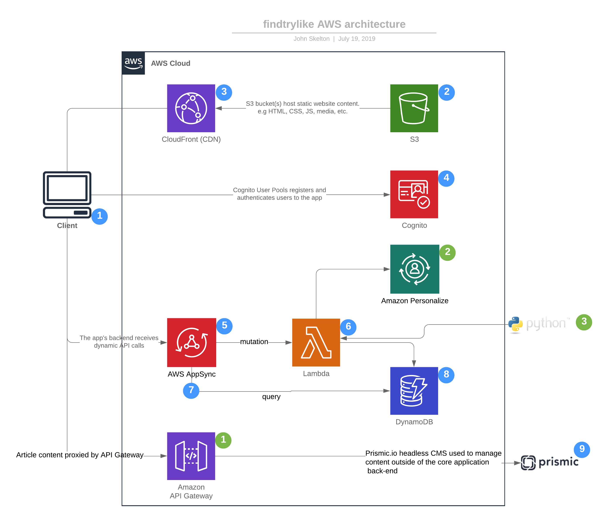

# findtrylike-overview

Choice morsels from the architecture and development of the [findtrylike site](https://www.findtrylike.com/).  React, NodeJS, AWS - DynamoDB, AppSync (GraphQL), and headless CMS.

## Core Architecture

1. Requests are routed via [Amazon CloudFront](https://aws.amazon.com/cloudfront/), which handles SSL termination and routing.

1. Progressive [React](https://reactjs.org/)/[AWS Amplify](https://aws.amazon.com/amplify/) app stored in Amazon S3 are securely served through CloudFront.

1. [Amazon S3](https://aws.amazon.com/s3/) hosts static assets such as HTML, CSS, JS, and or media.

1. An [Amazon Cognito](https://aws.amazon.com/cognito/) user pool provides user management and identity providers (facebook initially, adding Google, twitter & others in time).

1. [Amazon AppSync](https://aws.amazon.com/appsync/) is used to send or receive dynamic content using GraphQL interface.

1. [Lambda](https://aws.amazon.com/lambda/) function(s) support Create, Update, Delete (GraphQL mutation) operations on top of DynamoDB - enables multi-step processing (including streaming response to Personalize for recommendation capability)

1. AppSync resolvers used to support Read operations on DynamoDB (GraphQL query).

1. [DynamoDB](https://aws.amazon.com/dynamodb/) provides the core backend NoSQL data store that elastically scales.

1. [Prismic.io](https://prismic.io/) used for headless content management.  Enables rich management of content without needing to access the production app back-end.

## On The Backlog

1. [API Gateway](https://aws.amazon.com/api-gateway/) used to proxy requests for content (articles) - enables intermediation for content transmogrification.

1. [Personalize](https://aws.amazon.com/personalize/) to provide real-time recommendations of products based on what other users have found, tried and liked.

1. Python used with [flashtext](https://github.com/vi3k6i5/flashtext) to parse new product recommendations (i.e. user posts) and identify common brands, products and so on.
